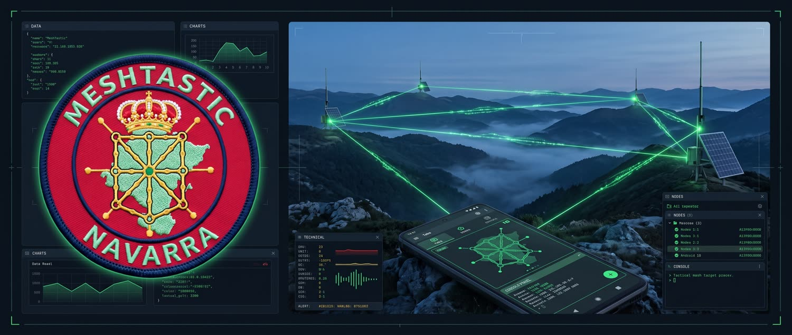

# MeshNavarra Utility



[](https://www.gnu.org/licenses/gpl-3.0)
[](https://developer.android.com/studio)
[](https://kotlinlang.org)
[](https://github.com/EA2OY/MeshNavarra-Utility/releases/latest)
[](https://github.com/EA2OY/MeshNavarra-Utility/releases/latest/download/MeshNavarra-Utility-v1.0.7.apk)
[](https://ko-fi.com/ea2oy)

Aplicación Android **no oficial** para administrar nodos **Meshtastic** — por USB OTG y Bluetooth LE — con una pestaña estrella de **control remoto NavaTastic CLI** para repetidores con el firmware Navarrico/NavaTastic (repo hermano: [EA2OY/NavaTastic](https://github.com/EA2OY/NavaTastic)).

---

## Características

| Pestaña | Qué hace |
|---|---|
| **Utilidades** | Buenas Prácticas (read-modify-write consciente del duty cycle ETSI EN 300 220) + presets de radio en un toque (SFN Spain 869.618 MHz + presets de módem estándar) |
| **Commands** | Telemetría, posición, traceroute, cambiar owner + popups con respuesta decodificada |
| **Administration** | Info de nodo, reboot, limpiar NodeDB (conservando favoritos), favorito/bloqueado, eliminar nodo, claves admin (PKI), Convertir en Nodo Maestro |
| **NavaTastic CLI** | Control remoto de repetidores Navarrico/NavaTastic (soporte completo Frente F21/F22): canales secundarios (slots 2-7), redirección CLI, silenciamiento Navadmin, pasarelas MQTT, posición fija y cadencias de difusión (pos_clear, set_pos_tx, set_nodeinfo_tx, set_telem_tx), diagnósticos 100% en RAM (stats/log), lista negra (ign clear ⚠) y control por DM cifrado PKI con compuerta CONFIRMAR |
| **Chat** | Historial persistente por canal, indicador de entrega (⟳ en camino / ✓ entregado / ✗ error + reenviar) |
| **Nodes** | Tarjetas de nodo (favoritos primero), caché propia persistente (sobrevive al NodeDB de 80 entradas del nodo), búsqueda inteligente, importar nodos por URL, popup de nodo con 11 acciones |
| **Log** | Consola persistente de peticiones/respuestas con botón de borrado de registros |
| **Debug** | Herramientas de desarrollo (oculta por defecto): modo de bajo impacto, sensores y baterías de auditoría |

**También incluye**: botones de desconexión rápida (USB y Bluetooth), interfaz bilingüe EN/ES, tema táctico DayNight, ayuda con pulsación larga en todos los botones, manuales en PDF dentro de la app, **dos demos guiadas** (clásica con puntero y **demo 2 con globos de texto** para grabar vídeos sin voz), nodo destino compartido entre pestañas, registro de errores a archivo, control remoto (receiver `com.meshkachoutility.REMOTE`) para pruebas scriptadas.

## Requisitos

- Android **8.0+** (API 26) — probada en Android 11 (Samsung), Android 12 (MIUI), Android 15 y Android 16 (HyperOS), con soporte edge-to-edge (targetSdk 35).
- Un nodo Meshtastic con:
  - **USB OTG** (familia nRF52) o **Bluetooth LE** (emparejarlo antes en los ajustes del sistema; los nodos Navarrico usan PIN `654321`).
- Para la pestaña NavaTastic CLI: un repetidor con el **firmware Navarrico/NavaTastic** (o cualquier nodo estándar para diagnóstico).

## Instalación

1. Descarga el último APK oficial desde **[Releases](https://github.com/EA2OY/MeshNavarra-Utility/releases)** o directamente con este enlace: **[Descargar MeshNavarra-Utility-v1.0.7.apk](https://github.com/EA2OY/MeshNavarra-Utility/releases/latest/download/MeshNavarra-Utility-v1.0.7.apk)**.
2. Permite instalar aplicaciones de fuentes desconocidas en tu dispositivo y abre el APK.
3. Conecta tu nodo por USB OTG o Bluetooth, o ejecuta un modo demo (Ayuda → "Ejemplo de uso (demo)" o "Tour guiado con globos (demo 2)") para verla en acción sin hardware.

La metadata de empaquetado F-Droid está en [`fdroid/`](fdroid/metadata.yml) (merge request de inclusión en curso: [#45843](https://gitlab.com/fdroid/fdroiddata/-/merge_requests/45843)).

## Compilar desde el código

Requiere JDK 17 (el proyecto incluye uno en `jdk-17/jdk-17.0.10+7`).

```powershell
$env:JAVA_HOME = "c:\Users\...\jdk-17\jdk-17.0.10+7"
.\gradlew.bat assembleDebug           # APK debug → app\build\outputs\apk\debug\
.\gradlew.bat testDebugUnitTest       # 24 tests unitarios
```

En Linux/macOS: `JAVA_HOME=/ruta/al/jdk17 ./gradlew assembleDebug`.

Artefactos: `app/build/outputs/apk/debug/app-debug.apk`.

## Seguridad

- La app **no almacena secretos** y nunca toca la clave privada del nodo. Las claves PKI de admin que muestra la pestaña Administration se leen del nodo (solo lectura).
- Los comandos NavaTastic destructivos (`set_chem`, `set_vbat`, `set_vwake`, `storm*`, `db_purge`, `db_clear`, `factory_reset`) exigen escribir **CONFIRMAR**.
- Los comandos de control a repetidores NavaTastic se envían como **DM cifrado PKI**; solo los admins autorizados reciben respuesta.
- Las escrituras de configuración son siempre **read-modify-write** (un `set_config` parcial borra la sección en el firmware real).
- Los cambios de radio requieren reiniciar el nodo para aplicarse.

Ver [SECURITY.md](SECURITY.md) para la política de reportes.

## Documentación

- [`Manual_app_MeshNavarra.md`](Manual_app_MeshNavarra.md) — manual completo de la app (español).
- Dentro de la app: Ayuda → manuales PDF (manual de la app, comandos NavaTastic, uso NavaTastic 4.2).
- La referencia de comandos `/nava` vive en el [repo del firmware](https://github.com/EA2OY/NavaTastic).

## 🌐 Ecosistema: MeshNavarra + NavaTastic (proyectos complementarios)

Estos dos proyectos están diseñados para funcionar **en conjunto** y sacar el máximo partido uno del otro:

- **[EA2OY/NavaTastic](https://github.com/EA2OY/NavaTastic)** — el **firmware del repetidor**: nodo solar de infraestructura con control remoto /nava, seguridad PKI, avisos de sueño/batería y gestión remota de la flota.
- **MeshNavarra Utility (esta app)** — la **herramienta de administración**: conexión USB OTG/BLE, diagnóstico y configuración del nodo, chat, y la pestaña **NavaTastic CLI** que cubre el catálogo completo de comandos /nava del firmware (diagnóstico por el canal Navadmin, control por DM PKI cifrado).

**Uso recomendado**: instala el firmware NavaTastic en tus repetidores de infraestructura y administra toda la flota desde MeshNavarra Utility. Ninguno de los dos es necesario para el otro — la app también funciona con nodos Meshtastic estándar y el firmware sin la app se gestiona con la app oficial o la CLI — pero juntos ofrecen la experiencia completa.

## ☕ Apoyar el proyecto

Si MeshNavarra Utility te resulta útil para gestionar tus nodos y repetidores, puedes apoyar el desarrollo y mantenimiento continuo invitándome a un café:

[](https://ko-fi.com/ea2oy)

---

## Descargo de responsabilidad (Disclaimer)

Esta es una aplicación **no oficial**, sin afiliación con el proyecto Meshtastic ni con el proyecto Navarrico. Se proporciona "tal cual", **sin garantía de ningún tipo**, expresa o implícita — consulte la [LICENSE](LICENSE) (GPL-3.0) completa. No nos hacemos responsables de daños directos, indirectos o consecuentes derivados de su uso. Una mala configuración del nodo (química de batería, umbrales de sueño, reset de fábrica) puede dejarlo inutilizado hasta recuperación física; úsala bajo tu propia responsabilidad.

## Licencia y contacto

Licenciada bajo la **GNU General Public License v3.0** — ver [LICENSE](LICENSE). Avisos de terceros en [NOTICE](NOTICE).

Contacto: taisoluciones@gmail.com

---

# MeshNavarra Utility (English)

[](https://www.gnu.org/licenses/gpl-3.0)
[](https://developer.android.com/studio)
[](https://kotlinlang.org)
[](https://github.com/EA2OY/MeshNavarra-Utility/releases/latest)
[](https://github.com/EA2OY/MeshNavarra-Utility/releases/latest/download/MeshNavarra-Utility-v1.0.7.apk)
[](https://ko-fi.com/ea2oy)

Unofficial Android app to administer **Meshtastic** nodes — USB serial and Bluetooth LE — with a flagship **NavaTastic CLI** remote-control tab for repeaters running the Navarrico/NavaTastic firmware (see the companion repo [EA2OY/NavaTastic](https://github.com/EA2OY/NavaTastic)).

## Features

| Tab | What it does |
|---|---|
| **Utilidades** | Good Practices (ETSI EN 300 220 duty-cycle aware read-modify-write) + one-tap radio presets (SFN Spain 869.618 MHz + stock modem presets) |
| **Commands** | Telemetry, position, traceroute, set owner + decoded response popups |
| **Administration** | Get node info, reboot, wipe NodeDB (keep favorites), set favorite/ignored, remove node, admin keys (PKI), Convert to Master Node |
| **NavaTastic CLI** | Remote control of Navarrico/NavaTastic repeaters (full Frente F21/F22 support): secondary channels (slots 2-7), CLI redirection, Navadmin muting, per-channel MQTT, static position & broadcast cadences (pos_clear, set_pos_tx, set_nodeinfo_tx, set_telem_tx), 100% RAM diagnostics (stats/log), blacklist purge (ign clear ⚠) and PKI-encrypted DM control with CONFIRMAR safety gate |
| **Chat** | Persistent per-channel history, delivery indicator (⟳ enroute / ✓ delivered / ✗ error + resend) |
| **Nodes** | Visual node cards (favorites first), own persistent cache (survives the node's 80-entry NodeDB), smart search, import nodes by shared URL, rich node popup with 11 request actions |
| **Log** | Persistent request/response console with clear log button |
| **Debug** | Developer tools (hidden by default): low-impact mode, sensor toggles, automated audit batteries |

**Also includes**: dedicated quick-disconnect buttons (USB & Bluetooth), bilingual UI (EN/ES), DayNight tactical HUD, long-press help on every button, in-app manuals (PDF), **two guided demos** (classic pointer tour + **demo 2 with text balloons** for recording voice-free videos), shared target node across tabs, crash-to-file logging, remote control (`com.meshkachoutility.REMOTE` receiver) for scripted testing.

## Requirements

- Android **8.0+** (API 26) — tested on Android 11 (Samsung), Android 12 (MIUI), Android 15 and Android 16 (HyperOS), with edge-to-edge support (targetSdk 35).
- A Meshtastic node with:
  - **USB OTG** (nRF52 family) or **Bluetooth LE** (pair it in system settings first; Navarrico nodes use PIN `654321`).
- For the NavaTastic CLI tab: a repeater running the **Navarrico/NavaTastic firmware** (or any stock node for diagnostics only).

## Installation

1. Download the latest official APK from the **[Releases](https://github.com/EA2OY/MeshNavarra-Utility/releases)** page or directly via this link: **[Download MeshNavarra-Utility-v1.0.7.apk](https://github.com/EA2OY/MeshNavarra-Utility/releases/latest/download/MeshNavarra-Utility-v1.0.7.apk)**.
2. Allow installing apps from unknown sources on your device, then open the APK.
3. Connect your node via USB OTG or Bluetooth, or run a demo tour (Help → "Usage example (demo)" or "Guided tour with balloons (demo 2)") to see it in action without hardware.

F-Droid packaging metadata is included under [`fdroid/`](fdroid/metadata.yml) (inclusion merge request in progress: [#45843](https://gitlab.com/fdroid/fdroiddata/-/merge_requests/45843)).

## Build from source

Requires a JDK 17 (the project bundles one at `jdk-17/jdk-17.0.10+7`).

```powershell
$env:JAVA_HOME = "c:\Users\...\jdk-17\jdk-17.0.10+7"
.\gradlew.bat assembleDebug           # debug APK → app\build\outputs\apk\debug\
.\gradlew.bat testDebugUnitTest       # 24 unit tests
```

On Linux/macOS: `JAVA_HOME=/path/to/jdk17 ./gradlew assembleDebug`.

APK artifacts: `app/build/outputs/apk/debug/app-debug.apk`.

## Security

- The app **stores no secrets** on-device and never touches the node's private key. PKI admin keys shown in the Administration tab are read from the node.
- Destructive NavaTastic commands (`set_chem`, `set_vbat`, `set_vwake`, `storm*`, `db_purge`, `db_clear`, `factory_reset`) are gated behind typing **CONFIRMAR**.
- Control commands to NavaTastic repeaters are sent as **PKI-encrypted DMs**; only authorized admins get a response.
- Config writes are always **read-modify-write** (a partial `set_config` wipes the section on real firmware).
- Radio changes need a node reboot to take effect.

See [SECURITY.md](SECURITY.md) for reporting guidelines.

## Documentation

- [`Manual_app_MeshNavarra.md`](Manual_app_MeshNavarra.md) — full app manual (Spanish).
- In-app: Help → PDF manuals (app manual, NavaTastic commands, NavaTastic usage 4.2).
- NavaTastic `/nava` command reference lives in the [firmware repo](https://github.com/EA2OY/NavaTastic).

## 🌐 Ecosystem: MeshNavarra + NavaTastic (complementary projects)

These two projects are designed to work **together** and get the most out of each other:

- **[EA2OY/NavaTastic](https://github.com/EA2OY/NavaTastic)** — the **repeater firmware**: solar infrastructure node with remote `/nava` control, PKI security, sleep/battery announcements and fleet management.
- **MeshNavarra Utility (this app)** — the **administration tool**: USB OTG/BLE connection, node diagnostics and configuration, chat, and the **NavaTastic CLI** tab covering the full `/nava` command catalog of the firmware (diagnostics over the Navadmin channel, control over encrypted PKI DMs).

**Recommended usage**: install the NavaTastic firmware on your infrastructure repeaters and administer the whole fleet from MeshNavarra Utility. Neither project requires the other — the app also works with stock Meshtastic nodes, and the firmware can be managed with the official app or the CLI — but together they provide the full experience.

## ☕ Support the project

If MeshNavarra Utility helps you manage your nodes and repeaters, you can support ongoing development and maintenance by buying me a coffee:

[](https://ko-fi.com/ea2oy)

---

## Disclaimer

This is an **unofficial** app, not affiliated with Meshtastic or the Navarrico project. Provided "as is", without warranty of any kind — see the full GPL-3.0 [LICENSE](LICENSE). Misconfiguring a node (battery chemistry, sleep thresholds, factory reset) can leave it unusable until physical recovery; use at your own risk.

## License & contact

Licensed under the **GNU General Public License v3.0** — see [LICENSE](LICENSE). Third-party notices in [NOTICE](NOTICE).

Contact: taisoluciones@gmail.com
